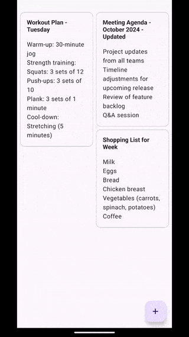
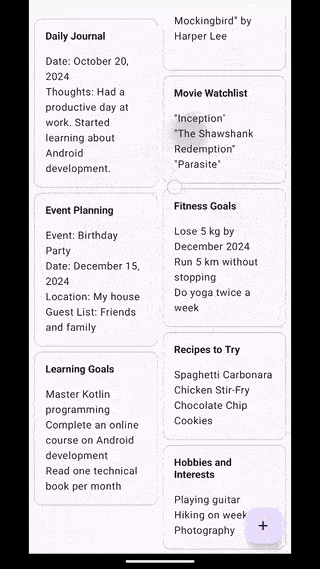
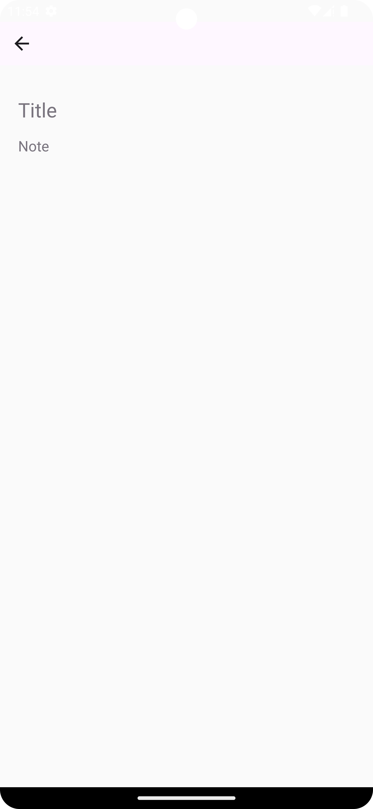

# Panatilihin

Panatilihin is a feature-rich note-taking application inspired by Google Keep. I created this project to highlight my expertise in mobile development and my ability to implement industry-standard practices. I aim to demonstrate my commitment to following best practices in software development and architecture. With a clean and intuitive user interface, this app allows users to create, edit, and manage their notes seamlessly.

# Features

**Create Notes:** Users can easily add new notes by entering text into a user-friendly interface. Changes are automatically saved in real-time as users type, ensuring that no data is lost.

**Edit Notes:** Existing notes can be edited seamlessly. As users modify the content, updates are saved automatically, allowing for a hassle-free editing experience without the need for a manual save action.

**View All Notes:** All saved notes are displayed in a clean, scrollable list, making it easy to browse through your entries.

## Screenshots
 
